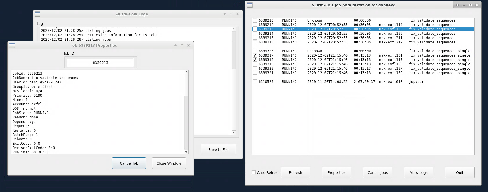

# Slurm Cola

*Slurm, the number-one soft drink of the future, is refreshingly addictive.*

slurm-cola tool developed within EuXFEL's detector group to manage a user's
jobs, ie: cancel them in bulk.  

Although tailored for EuXFEL's calibration pipeline, there's no reason that
it might not work for you.

As part of the calibration pipeline, slurm jobs are submitted per
[data run](https://extra-data.readthedocs.io/en/latest/parallel_example.html#Using-SLURM).  
These jobs share in common their name, which allows grouping and bulk actions
on them.

## Installing

This package requires Python 3.6+, and can be installed so:

    git clone ssh://git@github.com/cydanil/slurm-cola
    cd slurm-cola
    pip install .

## Usage

*slurm-cola* is a graphical application, launch it so:

    $ slurm-cola

In the main window, you will be given a list of jobs for the current user.
Clicking on one will show its settings.

A simple logging window is available for easier reporting during OCD calls.

It's possible to specify the user:

    $ slurm-cola <username>

Cancelling jobs for that user will require you to have the correct permissions
though.

## Future Development
*slurm-cola* is still under early development. There are plans of, in the following order:
- [ ] batch cancellation (despite what's been promised, only a job at a time can be dealt with currently)
- [ ] auto-refresh with feedback
- [ ] cool logo
- [ ] prettier job info display
